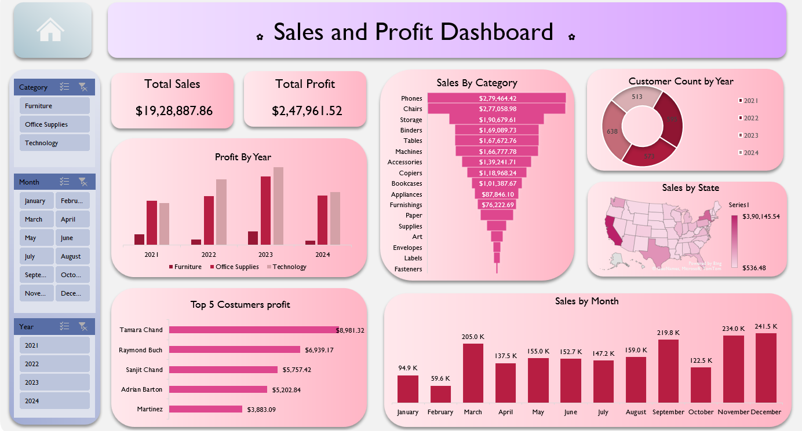

# 🌸 Sales & Profit Dashboard 

> *A cute, pastel-themed Excel dashboard showing sales & profit at-a-glance* ✨

---

## 🎯 Project Objectives
- Turn raw sales records into **actionable visual insights**.  
- Provide an **interactive, filterable dashboard** for quick business checks (city, month, category, rep, year).  
- Present both **trend** (monthwise) and **segmented** (city / channel / category / rep) views.  

---

## 📂 Files in this folder
- `Sales & Profit Data.xlsx` — the working Excel workbook (dashboard + raw data).  
- `dashboard-img.png` — preview image (used above).  
- `README.md` — this file

---

## 🧾 Data used
The workbook uses a simple sales dataset (practice / real-like) with columns such as:
- **Date / Month** (Jan–Dec)
- **City / State**
- **Channel** (Online, Retail)
- **Representative** (sales rep)
- **Category** (Clothing, Electronics, Furniture, Food, etc.)
- **Sales Amount** (revenue)
- **Profit** (optional column used for profit visuals)

---

## 🔍 What’s included in the dashboard
- **Top KPI cards**: Total Sales, Total Profit (big & pretty).  
- **Profit by Year**: Bar chart showing yearly profit split by category.  
- **Sales by Category**: Funnel / bar style to visualize category contribution.  
- **Customer / Rep donut**: Customer counts or rep performance by year.  
- **Sales by State**: Choropleth / map view for geographic insight.  
- **Top 5 Customers / Reps**: Horizontal bars showing top contributors.  
- **Sales by Month**: Trend bars to spot seasonality and peaks.  
- **Slicers / Filters**: Year, Month, Category — click to instantly update visuals.

---

## 🛠 Tools & Techniques
- **Microsoft Excel** 
- **PivotTables** & **PivotCharts** 
- **Slicers**  
- Chart formatting

---

## 🚀 How to use
1. Open `Sales & Profit Data.xlsx` in Excel.  
2. If prompted, **Enable Content** (so slicers and pivot cache load).  
3. Use the left-side slicers (Year / Month / Category) to filter the whole dashboard.  
4. Click any chart element (e.g., a bar or map region) to cross-filter other visuals.  
5. To refresh after replacing data: **Right-click → Refresh** on any PivotTable or use **Data → Refresh All**.

---

## ✨ Key insights 
- Which **city** or **state** brings the highest revenue?  
- Do **online** or **retail** channels perform better this year?  
- Which **category** is growing month-over-month?  
- Who are the **top-performing reps/customers** worth rewarding?

---

## 🔮 Future improvements (roadmap)
- Add KPI tiles (Avg Order Value, Conversion %, YoY growth).  
- Add conditional formatting for quick red/green signals.  
- Automate data ingestion via **Power Query** (CSV, Google Sheets, or database).  
- Recreate in **Power BI** for advanced interactivity and sharing.  
- Add a small `INSIGHTS.md` capturing monthly observations.

---

## 🤝 Contributing
Want to help make this dashboard cuter or smarter?
1. Fork the repo → create a branch (e.g., `feature/power-query`).  
2. Add your improved workbook in a new folder (e.g., `sales-dashboard-v2/`) with a preview image and a short `README.md`.  
3. Open a PR — I’ll review, add sparkles ✨, and merge if it slays.

---

## 📜 License & credits
- **Author:** Komal Harshita 🌸  

---

